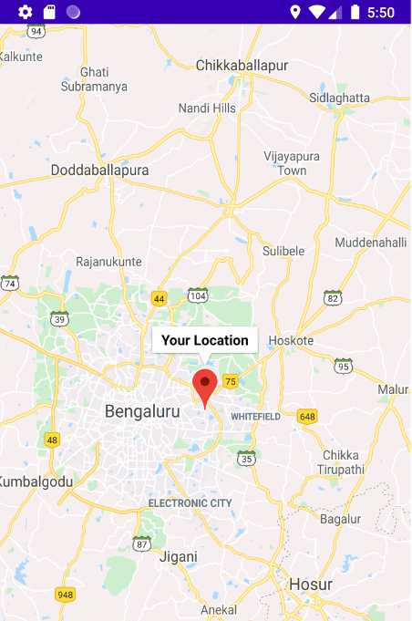
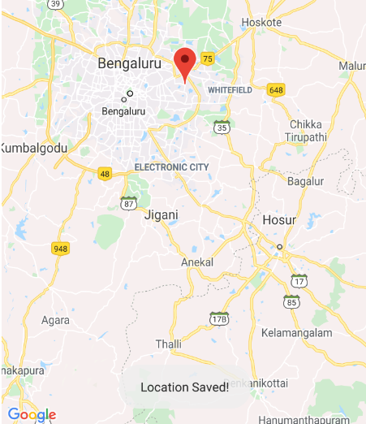
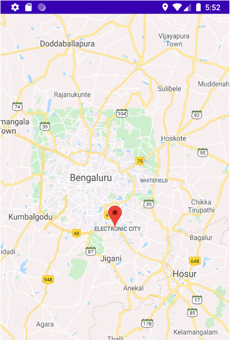

# Tourism-App
In this App, you can bookmark and save your favorite tourist places that you wanted to visit..

Initially, the app shows your current location in the city

Now, for example, I wanted to visit "Electronic City" which is a major IT Hub of Bangalore...You just need to tap on "Electronic City" and hold for a few seconds for it to add it into the list...

Now you will get a "Toast Message" which says that the Current location has been saved into our list as shown below....

Now just click on the list Item to direct you and set the marker at Electronic City..

In this way you can add as many places as you like into your list and try visiting all your favorite places in the city... :)
